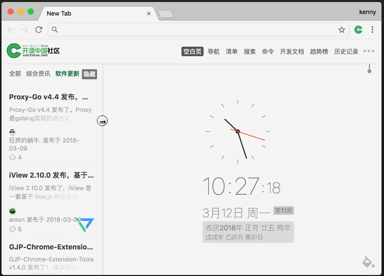
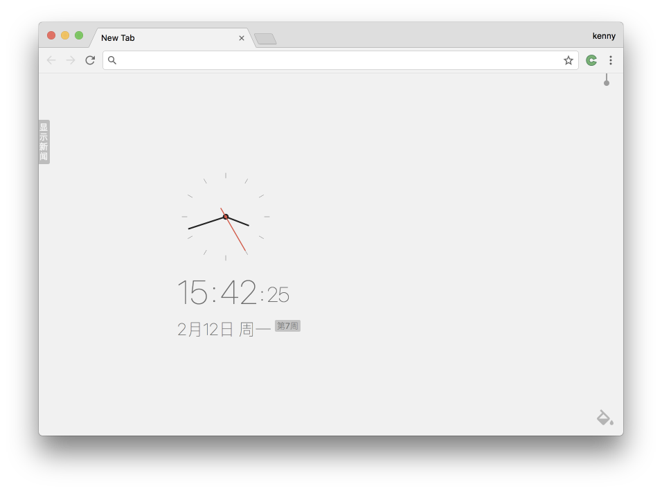
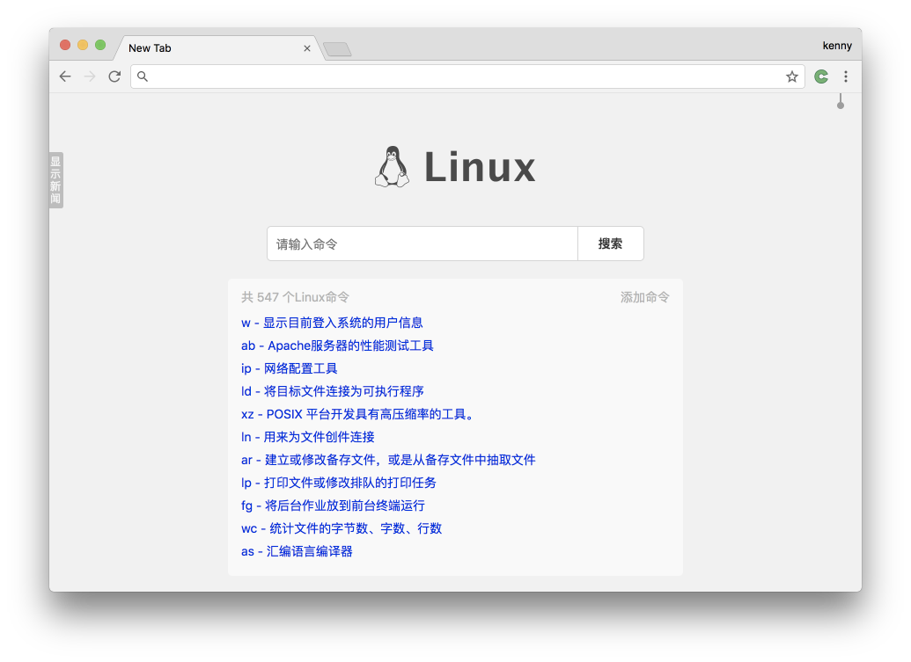
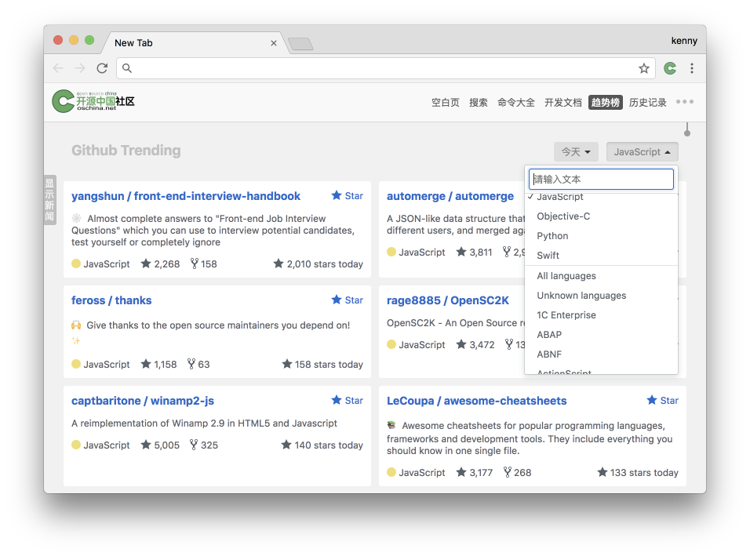
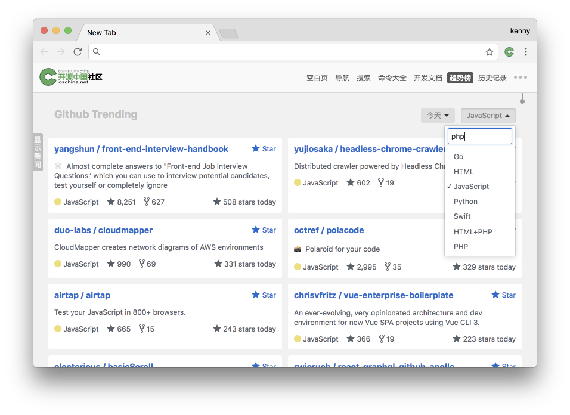

<p align="center">
  <a href="http://www.oschina.net/">
    
  </a>
</p>

这是一个Chrome插件，在新标签页查看开源中国[软件更新资讯](http://www.oschina.net/news/project)，搜索页面、GitHub 趋势榜、linux 命令索引，浏览历史记录，时钟页面。

<p align="center">
   
</p>

## 商店安装

[Chrome 网上商店](https://chrome.google.com/webstore/detail/oscnews/iheapfheanfjcemgneblljhaebonakbg) 搜索 `oscnews` 安装，或者直接下载 [crx 文件](https://github.com/jaywcjlove/oscnews/releases) 安装，打开 [chrome://extensions](chrome://extensions/) 将 crx 拖拽到扩展列表中安装。

[](https://chrome.google.com/webstore/detail/oscnews/iheapfheanfjcemgneblljhaebonakbg)


> [开源中国下载 oscnews.crx 文件](https://gitee.com/jaywcjlove/oscnews/releases)  
> [Github下载 oscnews.crx 文件](https://github.com/jaywcjlove/oscnews/releases) 

<div align="center">
   
   
   
   
   
   
</div>

## 开发模式安装

下载源文件

```bash
git clone https://github.com/jaywcjlove/oscnews.git --depth=1 --recurse-submodules
# 开源中国仓库
git clone https://gitee.com/jaywcjlove/oscnews.git --depth=1 --recurse-submodules
```

安装依赖

```bash
npm install 
```

编译源码

```bash
npm run build
```

下载编译之后，在 Chrome 浏览器地址栏输入 [chrome://extensions](chrome://extensions/)  打开插件界面，通过下图方式，将生成的 `oscnews` 目录，导入到插件列表中。


应用商店生成 crx 文件

```diff
- https://clients2.google.com/service/update2/crx?response=redirect&x=id%3D<这里是扩展ID>%26uc&prodversion=32
+ https://clients2.google.com/service/update2/crx?response=redirect&x=id%3Diheapfheanfjcemgneblljhaebonakbg%26uc&prodversion=32
```

Mac系统下扩展的源码目录

```bash
cd /Users/kenny/Library/Application Support/Google/Chrome/Default/Extensions
```

## TODO

- [x] 浏览历史记录
  - [ ] 浏览历史选择今天、周、全部
  - [x] 清空历史记录
- [x] 开发文档导航
  - [x] 开发文档导航搜索过滤
  - [x] ~~添加删除文档？~~
  - [x] 文档分类前端（前端、后端、工具）
- [x] Linux命令检索，集成 [linux-command](https://github.com/jaywcjlove/linux-command)
- [x] Github 趋势榜天、周、月统计切换，语言切换
- [x] 配置存储使用 [chrome.storage](https://developer.chrome.com/apps/storage) 替代
- [x] 添加搜索引擎页面
- [x] 开源中国新闻
  - [x] 宽度拖拽设置
  - [ ] 下拉翻页
- [x] 空页面
  - [ ] 天气日期展示
  - [x] 更换背景色
  - [x] 添加时钟效果
- [ ] 书签管理页面
- [ ] 常用网站导航
- [ ] Github
  - [ ] Github 登录，浏览自己项目
  - [ ] Github Start 管理
- [ ] Gitlab 登录，相关功能
- [ ] 集成 [octotree](https://github.com/buunguyen/octotree) 部分功能
- [ ] 插件官方网站
- [ ] 密码管理器
- [ ] RSS订阅功能
- [ ] 提醒事项
  - [ ] 记录代办事项
  - [ ] Chrome通知
- [x] 设置功能
  - [x] 设置是否替换新标签页显示
  - [ ] 设置URL是否在新的标签页打开，
  - [ ] 菜单配置
  - [ ] 清空历史
  - [ ] 分享应用到微博
- [ ] 兼容其它浏览器
  - [x] 兼容QQ浏览器，已测试下载crx文件安装直接可以用
  - [ ] 兼容360急速浏览器
  - [ ] 兼容Firefox浏览器

## License

The MIT License (MIT)